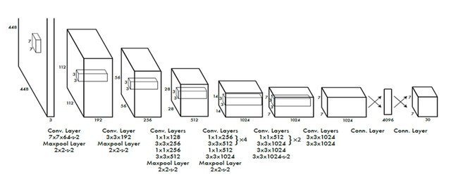

# Pickleball Vision System

This repository contains a comprehensive computer vision pipeline for pickleball match analysis.

## 🗄️ Datasets

We built this system using datasets hosted on Roboflow:
*   **Court Segmentation:** [Pickleball Court Dataset](https://app.roboflow.com/meo-4zf6i/pickleball-court-cfyv4-b0cj8/1) 
    *   Model: yolo26n
    *   Images: 1324
    *   Size: 432x432
    *   Train/Test/Val Split: 68/16/16
*   **Player Tracking:** [Pickle Ball Players Dataset](https://app.roboflow.com/meo-4zf6i/pickle_ball_players/1)
    *   Model: yolo26n
    *   Images: 3112
    *   Size: 512x512
    *   Train/Test/Val Split: 79/11/11
*   **Ball Detection:** [Pickleball Vision Dataset](https://app.roboflow.com/meo-4zf6i/pickleball-vision-9vaey/2)
    *   Images: 6202
    *   Train/Test/Val Split: 76/12/12

---

## 🧠 Models Used

### YOLO Architecture
For our primary object detection and segmentation tasks, we employ **YOLO** (You Only Look Once), a fast and highly efficient convolutional neural network. The YOLO architecture is inspired by the GoogLeNet model for image classification.

### TrackNet Architecture
We use **TrackNet**, a state-of-the-art model specialized in high-speed sports ball tracking, as a baseline to compare against our yolo26n model.

### Ball Tracking Performance
Our custom yolo26n ball tracking model achieved the following metrics on the evaluation dataset:
*   **mAP@50:** 55.6%
*   **Precision:** 49.5%
*   **Recall:** 61.0%

## 📊 Performance Comparison: YOLO vs. TrackNet

We evaluated our **yolo26n** approach against **TrackNet** for ball tracking performance. The metrics show significant advantages in detection stability and coverage.

| Metric | TrackNet (Baseline) | yolo26n (Our Model) |
| :--- | :--- | :--- |
| **Detected Frames** | 37.42% (424/1133) | **55.87% (633/1133)** |
| **Max Miss Streak** | **1.57s (47 frames)** | 4.43s (133 frames) |
| **Median Speed** | 17.49 px/frame | 16.47 px/frame |
| **95th Pct Speed** | 476.56 px/frame | **43.56 px/frame** |
| **Jitter Spikes (>80px)** | 32 | **5** |

---

## ⚙️ Methodology & Pipeline

The system is designed to provide robust tracking across various scenarios. 

### TrackNet Baseline Inference
Below is an example of TrackNet inference on a video frame:

### Homography & Court Tracking
Our pipeline relies on projecting the 3D court space onto a 2D top-down view using a homography matrix. We compute this matrix dynamically by using YOLO for court segmentation, extracting the key points, and mapping them to their real-world dimensions.

Here is an inference of YOLO segmentation combined with the homography projection on a single video frame:

### Combined Pipeline Output
When tying all components together—Player Tracking, Ball Tracking, Court Segmentation, and Homography—the complete system processes the video to produce comprehensive visual tracking information.

*   **Video Inference Link:** [Link to the inference video](https://drive.google.com/file/d/1uZTPiMMsqEjl3Xe34z4AA_ppG15MowQM/view?usp=sharing)
*   4.  **Processing:** The Combined pipeline took 264.4s to process 1133 frames of a highlight video (AMD RYZEN 5 4600H, 16GB RAM, No GPU)