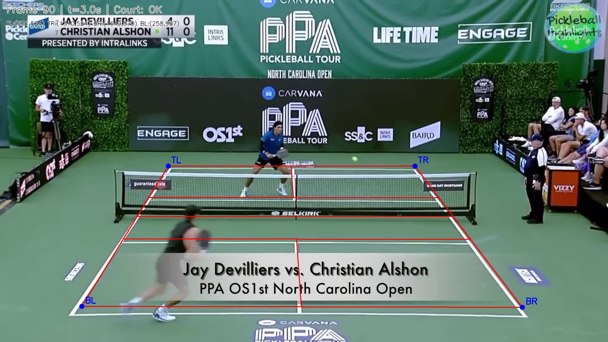

# Pickleball Vision System

A comprehensive computer vision pipeline for pickleball match analysis, leveraging YOLOv8n for multiple detection and segmentation tasks to track players, balls, and court boundaries.

## 🚀 System Overview

The project utilizes specialized models to extract meaningful data from pickleball footage:

*   **Player Tracking:** yolo26n integrated with **ByteTrack** for consistent player ID maintenance.
*   **Ball Detection:** yolo26n optimized for small object detection to track the high-speed pickleball.
*   **Court Segmentation:** yolo26n for precise identification of the court boundaries and key areas.

---

## 📸 Inference Demonstrations

### 1. Players & Ball Tracking
The system accurately identifies players and tracks the ball's trajectory throughout the rally.

### 2. Players & Umpire Detection
In addition to athletes, the model is trained to recognize officials for better spatial context.

### 3. Court Segmentation
Advanced segmentation masks are applied to define the field of play, enabling automated line-call analysis.

### 4. Homography Transformation
The system projects the segmented court to a 2D top-down view using homography, ensuring accurate spatial mapping for analysis. The homography matrix is computed dynamically on **every frame**, resulting in robust performance even with moving or panning cameras.

---

## 📊 Performance Comparison: YOLO vs. TrackNet

We evaluated our **yolo26n** approach against **TrackNet** for ball tracking performance. The metrics show significant advantages in detection stability and coverage.

| Metric | TrackNet (Baseline) | yolo26n (Our Model) |
| :--- | :--- | :--- |
| **Detected Frames** | 37.42% (424/1133) | **55.87% (633/1133)** |
| **Max Miss Streak** | **1.57s (47 frames)** | 4.43s (133 frames) |
| **Median Speed** | 17.49 px/frame | 16.47 px/frame |
| **95th Pct Speed** | 476.56 px/frame | **43.56 px/frame** |
| **Jitter Spikes (>80px)** | 32 | **5** |

### **Key Takeaways:**
1.  **Higher Coverage:** yolo26n detected the ball in **~18% more frames** than TrackNet.
2.  **Superior Stability:** TrackNet exhibited high jitter with **32 spikes** over 80px and an unrealistic 95th percentile speed (476px), suggesting frequent "teleportation" errors. yolo26n remained extremely stable with only **5 jitter spikes**.
3.  **Consistency:** While TrackNet had a shorter maximum miss streak, its detections were far noisier. yolo26n's lower 95th percentile speed (43.56px) represents a much more physically accurate ball trajectory.
4.  **Processing:** The Combined pipeline took 264.4s to process 1133 frames of a highlight video (AMD RYZEN 5 4600H, 16GB RAM, No GPU)